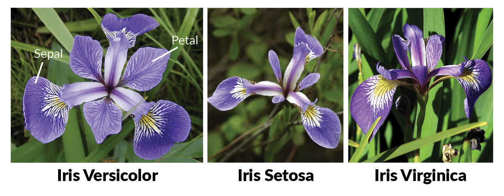

# HeatWave AutoML WORKSHOP

このワークショップでは、HeatWave AutoMLの機能を使用して、アヤメ(Iris)の花の種類を分類するプロジェクトを実装します。このプロジェクトは、機械学習のHello Worldバージョンとしても知られています。

データを準備し、ML_TRAINルーチンを使ってモデルを学習し、ML_PREDICT_ルーチンとML_EXPLAIN_ルーチンを使って予測と説明を生成します。
最後に、ML_SCOREルーチンを使ってモデルの品質を評価し、モデルの説明を見てモデルがどのように機能するかを理解します。

**このワークショップで学べること**
-	MySQL HeatWaveのデプロイ
-	HeatWaveへのデータロード
-	HeatWaveを利用したクエリ実行方法
-	HeatWave AutoMLを利用した機械学習モデル作成・利用方法

**前提条件**
-  このハンズオンでは、Oracle Cloud Infrastructureのアカウントが必要になります。有償アカウント、もしくはトライアルアカウントをご用意ください。
-  コンパートメントが作成されたテナンシが必要になります。
-  トライアルアカウントについては以下を参照ください。
- **[OCI Cloud Free Tier]
(https://www.oracle.com/jp/cloud/free/)**. 
-  OCIコンソールの利用方法は以下を参照ください。
- **[OCIコンソールにアクセスして基本を理解する]
(https://oracle-japan.github.io/ocitutorials/beginners/getting-started/)**. 

**ワークショップで利用するデータについて
このワークショップでは、UCI Machine Learning Repositoryから公開されているIris Data Setを使用します。
Iris Data Setには以下のデータがあり、萼片と花弁の特徴を用いてクラスラベルを予測します。

アイリスの種類

    sepal length がく片の長さ (cm)
    sepal width  がく片の幅 (cm)
    petal length 花弁の長さ (cm)
    petal width  花びらの幅 (cm)
がく片は蕾の段階で花を包み保護する部分。花弁は葉のような部分。

可能なクラス値：

    Iris Setosa      ヒオウギアヤメ
    Iris Versicolour ブルーフラッグ
    Iris Virginica   バージニカ

# ワークショップ概要
準備ができたらはじめましょう！

## Lab 0 - コンパートメントを作成する

## Lab 1 - 仮想ネットワークを作成する

## Lab 2 - MySQL HeatWaveインスタンスを作成する

## Lab 3 - MySQL HeatWaveに接続する

## Lab 4 - データをロードする

## Lab 5 - HeatWaveクラスタを追加する

## Lab 6 - HeatWave AutoMLで機械学習モデルを生成する
### Lab6-1 - 分類
### Lab6-2 - 回帰
### Lab6-3 - 時系列予測
### Lab6-4 - 教師なし異常検知
### Lab6-5 - レコメンド

## Lab 7 - インスタンスの停止

## Appendix - データの準備について
