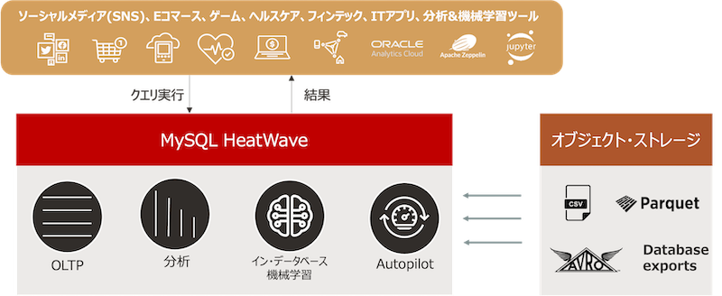

# HeatWave AutoML WORKSHOP

MySQL HeatWaveは、RDBやDWHだけでなく機械学習プラットフォームも備えたマネージドサービスです。

**MySQL HeatWave概要(Oracle資料から抜粋)**

HeatWave AutoMLはSQLで機械学習ルーチンを実行することで機械学習モデルの作成や予測を行うことができるため、より簡単に機械学習技術を利用できます。

このワークショップでは、インスタンスを起動してHeatWave AutoMLの機能を利用して、アヤメ(Iris)の花の種類を分類する機械学習モデルを実装します。このプロジェクトは、機械学習のHello Worldバージョンとしても知られています。

HeatWave AutoMLはML_TRAINルーチンを使ってモデルを学習し、ML_PREDICT_ルーチンとML_EXPLAIN_ルーチンを使って予測と説明を生成します。
最後に、ML_SCOREルーチンを使ってモデルの品質を評価し、モデルの説明を見てモデルがどのように機能するかを理解することができます。

**HeatWave AutoML実行の流れ(Oracle資料から抜粋)**

**このワークショップで学べること**
-	MySQL HeatWaveのデプロイ
-	HeatWaveへのデータロード
-	HeatWaveを利用したクエリ実行方法
-	HeatWave AutoMLを利用した機械学習モデル作成・利用方法

**前提条件**
-  このハンズオンでは、Oracle Cloud Infrastructureのアカウントが必要になります。有償アカウント、もしくはトライアルアカウントをご用意ください。
-  トライアルアカウントについてはこちらを参照ください-> **[OCI Cloud Free Tier](https://www.oracle.com/jp/cloud/free/)**
-  OCIコンソールの利用方法は以下を参照ください-> **[OCIコンソールにアクセスして基本を理解する](https://oracle-japan.github.io/ocitutorials/beginners/getting-started/)**

**ワークショップで利用するデータについて**

このワークショップでは、UCI Machine Learning Repositoryから公開されているIris Data Set(アヤメの分類)を使用します。

Iris Data Setには以下のデータがあり、がく片と花弁の特徴を用いてクラスラベルを予測します。

Irisの分類：
-  sepal length がく片の長さ (cm)
-  sepal width  がく片の幅 (cm)
-  petal length 花弁の長さ (cm)
-  petal width  花びらの幅 (cm)
がく片は蕾の段階で花を包み保護する部分。花弁は葉のような部分。

クラスラベル：
-  Iris Versicolour ブルーフラッグ
-  Iris Setosa      ヒオウギアヤメ
-  Iris Virginica   バージニカ

# ワークショップ概要

## Lab 0 - [OCIコンソールにログインする](./lab0/readme.md)

## Lab 1 - [仮想ネットワークやMySQL HeatWaveインスタンスを作成する](./lab1/readme.md)

## Lab 2 - [HeatWaveクラスタを追加する](./lab2/readme.md)

## Lab 3 - [MySQL HeatWaveインスタンスに接続する](./lab3/readme.md)

## Lab 4 - [HeatWave AutoMLで機械学習モデルを生成する](./lab4/readme.md)

## Lab 5 - [MySQL HeatWaveを利用したPHPアプリケーションを作成する](./lab5/readme.md)

## Lab 6 - [OCIサービスを停止する](./lab6/readme.md)

## Lab 7 - [HeatWave AutoMLで作成できる機械学習モデル](./lab7/readme.md)

