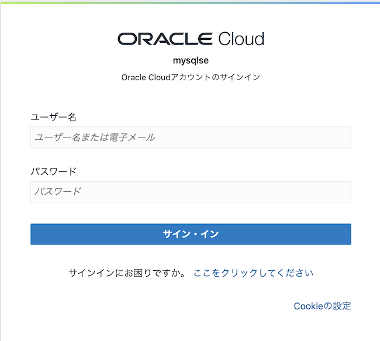

# lab0:OCIコンソールにログイン
## はじめに
Oracle Cloudは、パブリック・クラウドからお客様のデータ・センターまで幅広い導入オプションを提供する、広範かつ統合されたクラウド・プロバイダーです。

Oracle Cloudは、SaaS（Software as a Service）、PaaS（Platform as a Service）、およびIaaS（Infrastructure as a Service）にわたってクラス最高のサービスを提供します。

### クラウド・アカウントの種類
クラウドアカウントには2種類あります：
- 無償アカウント： 無料のトライアルアカウント、もしくはOracle Cloudプロモーションにサインアップすると、ウェルカム・メールが送信されます。このメールには、クラウド・アカウントの詳細とサインイン認証情報が記載されています。登録にはクレジットカードの情報が必要になります。
- 有償アカウント： テナントのプロビジョニングが完了すると、オラクルはサインイン資格情報とURLを記載した電子メールをお客様の管理者に送信します。この管理者は、Oracle Cloudへのアクセスが必要な人ごとにユーザーを作成できます。電子メールを確認するか、管理者に連絡して、資格情報とアカウント名を確認してください。

**以下の情報が必要です**
- クラウドアカウント名(テナンシの名前。管理者から提供されるか、Oracle CloudのウェルカムEメールに記載されています。）
- ユーザー名
- パスワード

### タスク1: Oracle Cloudへのログイン
Oracle Cloudからサインアウトした場合は、以下の手順で再サインインします。

1. cloud.oracle.com に移動し、Cloud Account Name(クラウドアカウント名)を入力し、Next をクリックします。これは、アカウントを作成するときに選択した名前です。メールアドレスではありません。名前を忘れた場合は、確認メールを参照してください。

2. Continueをクリックして、ログイン入力フィールドを表示します。

3. クラウドアカウントの認証情報を入力し、[Sign In]をクリックします。ユーザー名はメールアドレスです。パスワードはアカウント登録時に選択したものです。

***マルチファクタ認証の場合は、デバイスでの認証など必要に応じて操作してください。***
***詳細はこちらを[参照](https://docs.oracle.com/en-us/iaas/Content/Identity/Tasks/usingmfa.htm)してください。***

4. これでOracle Cloudにサインインできました。

***[次のセクションへ](../lab1/readme.md)***
