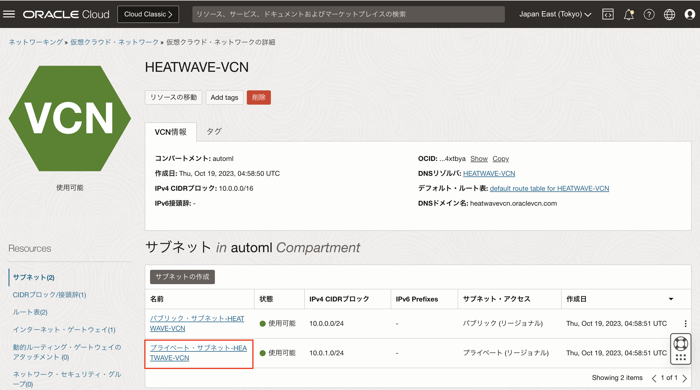
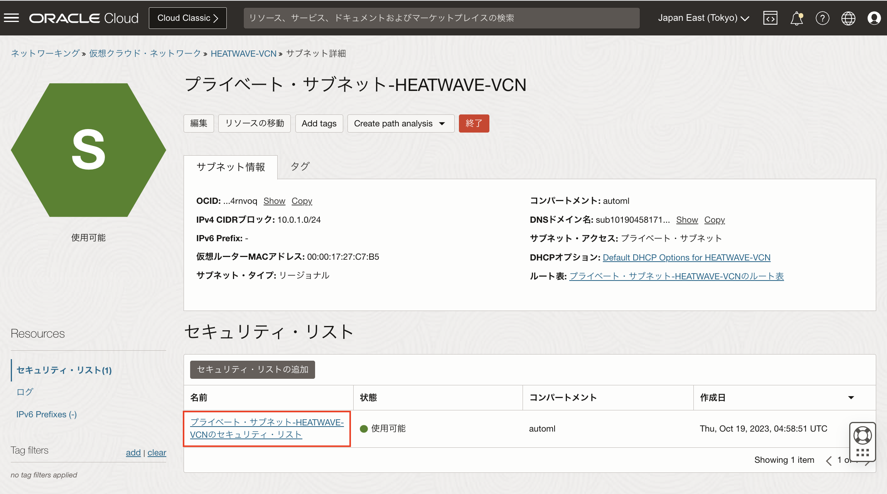

# MySQL HeatWaveインスタンスを作成する
ここでは、コンパートメント、仮想クラウドネットワークを作成してDBシステムを作成します。

**前提条件**
- MySQL Shellの利用

## タスク1: コンパートメントを作成する
1. OCIメニューから[アイデンティティとセキュリティ]-[コンパートメント]を選択します。
2. [コンパートメント]画面で[コンパートメントの作成]をクリックします。
3. [コンパートメントの作成]ダイアログで[名前][説明]を入力します。

  - 名前
  ```
  automl
  ```
  - 説明
  ```
  Compartment for AutoML with MySQL Database workshop
  ```
4. 親コンパートメントが自動的に表示されたら[コンパートメントを作成]をクリックします。


## タスク2: 仮想ネットワーク(VCN)を作成する
1. OCIメニューから[ネットワーキング]-[仮想クラウド・ネットワーク]を選択します。


2. [インターネット接続性を持つVCNの作成]を選択し[VCNウィザードの起動]をクリックします。


3. 基本情報を入力し、[次]をクリックします。

  - VCN名
  ```
  HEATWAVE-VCN
  ```
  - コンパートメント
  ```
  automlを選択
  ```


4. [確認および作成]画面で入力情報に誤りがないことを確認したら[作成]をクリックします。


5. VCNが作成されたら[VCNの表示]をクリックすると、作成したVCNの情報が確認できます。


## タスク3: MySQL HeatWaveへの接続を行うためにセキュリティ・リストを設定する

1. タスク2で作成したVCNの画面で[サブネット]-[プライベート・サブネット-HEATWAVE-VCN]をクリックします。


2. [セキュリティ・リスト]-[プライベート・サブネット-HEATWAVE-VCNの **セキュリティ・リスト** ]をクリックします。


3. [イングレス・ルール]-[イングレス・ルールの追加]をクリックします。


4. 以下の情報を指定し、[イングレス・ルールの追加]をクリックします。
  - ソースCIDR
  ```
  0.0.0.0/0
  ```
  - 宛先ポート範囲
  ```
  3306,33060
  ```
  - 説明
  ```
  MySQL Port Access
  ```


5. [プライベート・サブネット-heatwave-vcnのセキュリティリスト]画面の「イングレス・ルール」一覧に追加したイングレス・ルールが表示されます。


## タスク4: HTTP接続を行うためにセキュリティ・リストを設定する
1. OCIメニューから[ネットワーキング]-[仮想クラウド・ネットワーク]を選択します。
2. [HEATWAVE-VCN]をクリックして詳細画面を開きます。
4. [Default Security List for HEATWAVE-VCN]をクリックします。
5. [イングレス・ルール］-［イングレス・ルールの追加］をクリックします。
  - ソースCIDR
  ```
  0.0.0.0/0
  ```
  - 宛先ポート範囲
  ```
  80,443
  ```
  - 説明
  ```
  Allow HTTP connections
  ```


6. [Default Security List for HeatWave-VCN]の[イングレス・ルール]一覧に追加したイングレス・ルールが表示されます。


## タスク5: MySQL HeatWaveインスタンスを起動する
1. OCIメニューから[データベース]-[MySQL HeatWave]-[DBシステム]を選択します。


2. [DBシステムの作成]ボタンをクリックします。


3. DBシステムオプションで以下を選択します。

    **- 開発またはテスト**

    **- スタンドアロン**
  
    **- MySQL HeatWave**


5. [DBシステム情報の指定]で以下の情報を入力します。

  - コンパートメントに[automl]を選択します。

  - 名前
  ```
  HEATWAVE-DB
  ```
  - 説明
  ```
  MySQL HeatWave Database Instance
  ```
  - 管理者資格証明の作成(任意の値を設定してください)

    ***DB管理者になりますので失念するとDBにログインできません***

      **- ユーザ名**
  
      **- パスワード**
  
      **- パスワードの確認**


  
6. [ネットワーキングの構成]で以下の値が設定されていることを確認します。

  - 仮想クラウドネットワーク: **HEATWAVE-VCN**

  - サブネット: **プライベート・サブネット-HEATWAVE-VCN(リージョナル)**


7. [配置の構成]で[AD-1]が選択され、[フォルト・ドメインの選択]はOFFになっていることを確認します。

8. [ハードウェアの構成]で以下の値を設定します。

  - シェイプの選択: **MySQL.HeatWave.VM.Standard**

  - データ・ストレージ・サイズ(GB): **1024(デフォルト)**


9. [バックアップの設定]で[自動バックアップ]が選択されていることを確認します。


10. [拡張オプションの設定]をクリックします。
11. [ネットワーキング]タブでホスト名にDBシステム名と同じ名前を入力します。
    - ホスト名
    ```
    HEATWAVE-DB
    ```


12. [DBシステムの作成]画面の入力内容を確認し、[作成]ボタンをクリックします。


13. 作成したDBシステムの詳細画面に遷移します。この時のステータスは[作成中]になっています。


14. プロビジョニングが終了すると、ステータスが[アクティブ]になります。


15. [HEATWAVE-DB]詳細画面-[リソース]メニュー-[エンドポイント]を選択し、IPアドレスが設定されていることを確認します。
