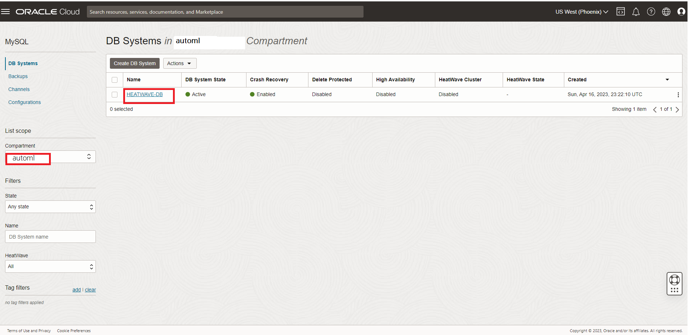
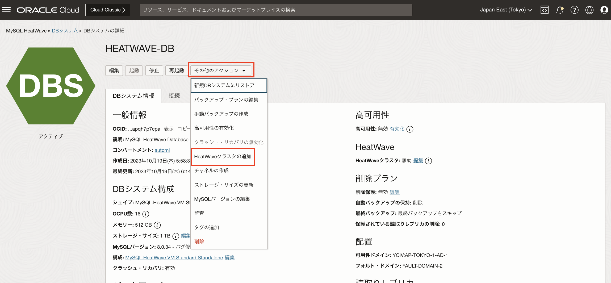
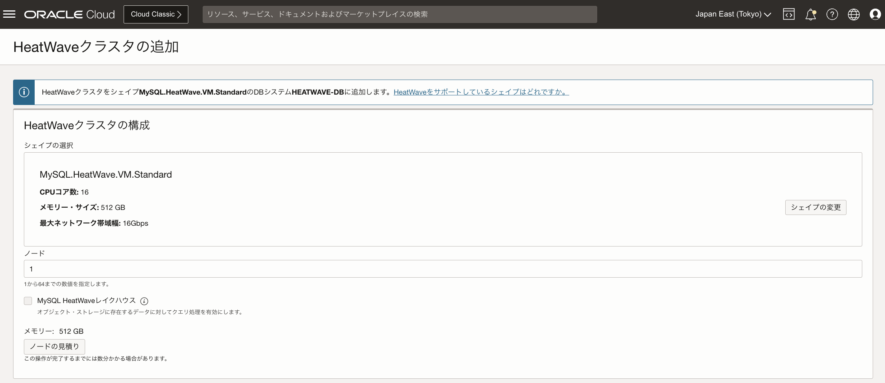
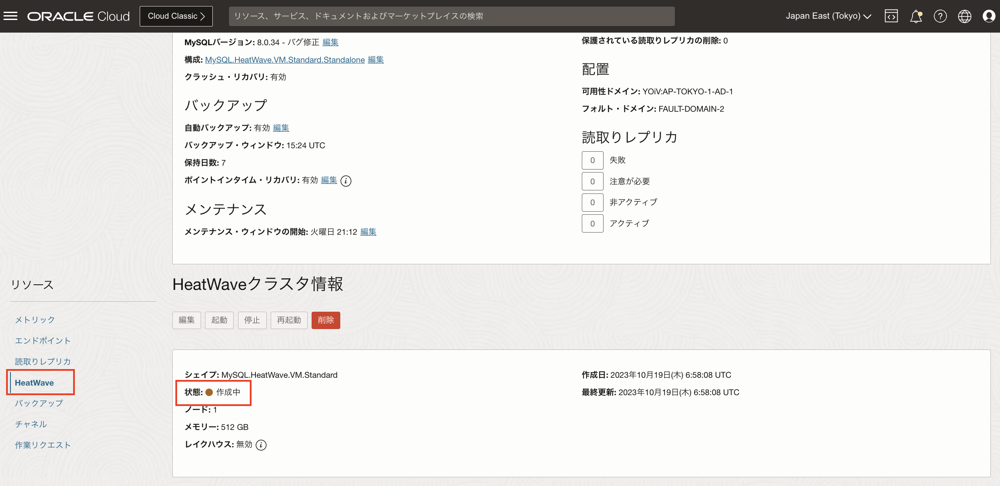

# HeatWaveクラスタを追加する
## はじめに
HeatWaveクラスタは、MySQL DBシステムと1台以上のHeatWaveノードで構成されます。

MySQL DBシステムには、クラスタ管理、HeatWaveクラスタへのデータロード、クエリのスケジューリング、クエリ結果の返送を行うプラグインが含まれています。

このセクションでは、lab1で起動したMySQL HeatWaveインスタンスへHeatWaveクラスタの追加を行います。

## タスク１: HEATWAVE-DBにHeatWaveクラスタを追加する
1. OCIメニューから[データベース]-[MySQL]-[DBシステム]を選択します。
2. automlコンパートメント配下のDBシステム一覧から[HEATWAVE-DB]を選択します。

3. [HEATWAVE-DB]の詳細画面で[その他のアクション]-[HeatWaveクラスタの追加]を選択します。

4. [HeatWaveクラスタの追加]ボタンをクリックします。

5. HeatWaveクラスタの追加が完了すると[リソース]メニュー-[HeatWave]-[HeatWaveクラスタ情報]に情報が表示されます。

   (HeatWaveクラスタの追加には10分程度かかります)

**補足資料**

[OCI MySQL HeatWaveドキュメント](https://docs.oracle.com/en-us/iaas/mysql-database/doc/heatwave.html)

***[次のセクションへ](../lab3/readme.md)***
