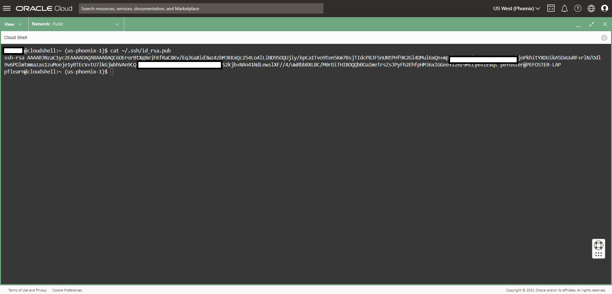
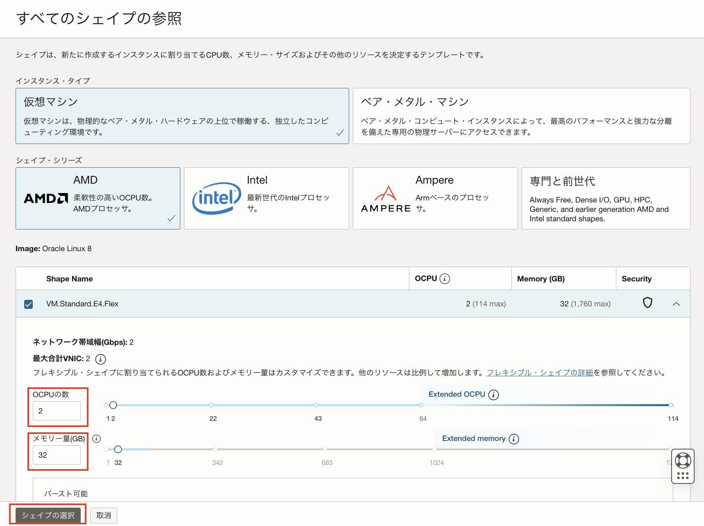
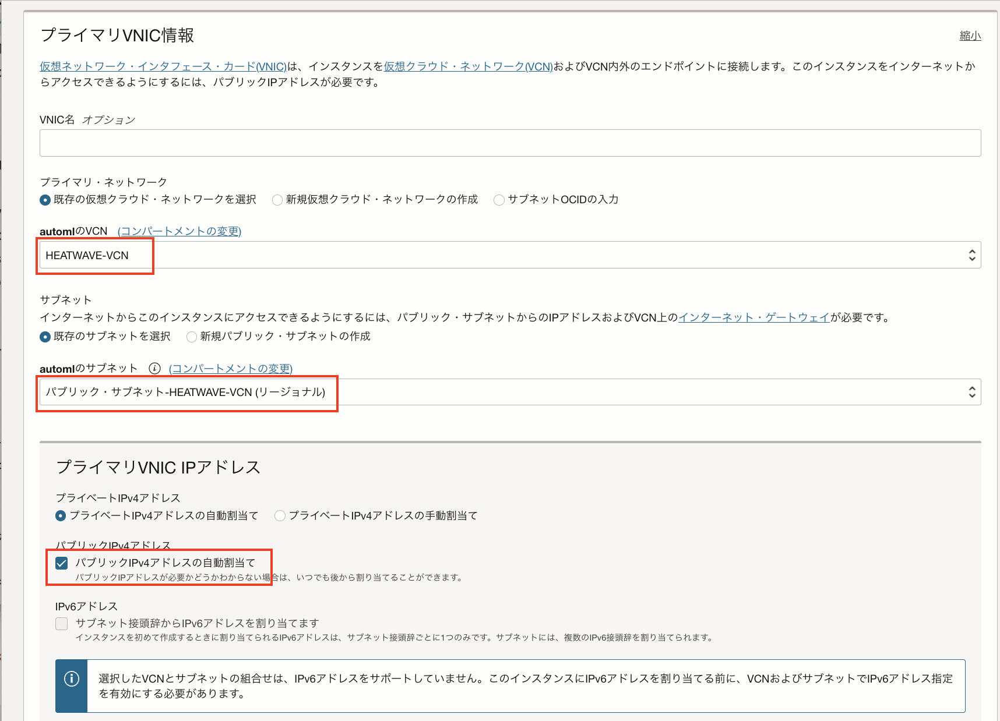
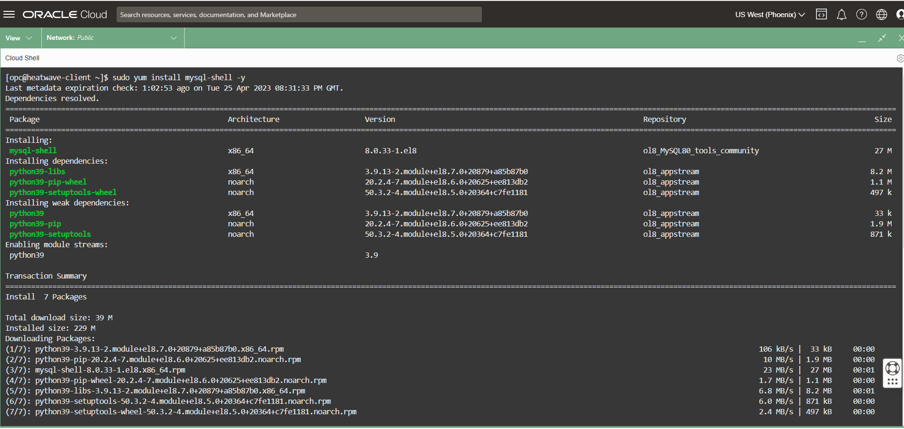

# MySQL HeatWaveへの接続

## はじめに
MySQL HeatWaveは、お客様のデータを潜在的な攻撃や脆弱性から保護するために、プライベートネットワークからのみアクセス可能なサービスです。

接続するためには踏み台サーバーやBastionサービスなどの利用が必要になります。

このワークショップでは、コンピュートインスタンス(VM)を使用して、ブラウザ(Cloud Shell)からMySQL HeatWaveに接続します。

そのためにこのセクションでは、SSHキー、コンピュートインスタンスを起動して、MySQL Shell(クライアント)をインストールします。

## タスク1: Cloud ShellからSSHキーを作成する

Cloud ShellはBashシェルを実行する仮想マシンで、OCIコンソールからアクセスします。

1. Cloud Sheを起動し、Bastion セッションで使用する SSH キーを生成します。

Oracle Cloud シェルを起動するには、Cloud コンソールに移動し、ページの右上にある[開発者ツール]アイコン-[Cloud Shell]をクリックします。

**TeraTermやPuTTY等のSSH接続ツールも利用できます。接続方法については[ドキュメント](https://docs.oracle.com/ja-jp/iaas/Content/GSG/Tasks/testingconnection.htm)を参照してください*


これでブラウザでCloud Shellが起動されますが、初回は生成に時間がかかる場合があります。

***Cloud Shell ウィンドウの右上隅にあるアイコンを使用して、Cloud Shell セッションを最小化、最大化、再起動、および終了することができます。***

2. Cloud Shellが起動したら、以下のコマンドでSSHキーを作成します。

  ```
  ssh-keygen -t rsa
  ```

  各質問に対してEnterキーを入力します。以下のようになります。

  
  
3. SSHの公開鍵と秘密鍵は**~/.ssh/id_rsa.pub**に格納されます。

4. 作成された2つのファイルを確認します。
  ```
  cd .ssh
  ```
  ```
  ls
  ```

  

  ***出力されるファイルには秘密鍵：id_rsaと公開鍵：id_rsa.pubの2つがあることに注意してください。***
  
  ***秘密鍵は安全に保管し、その内容を共有しないようにしてください。公開鍵は様々な操作に必要であり、特定のシステムにアップロードしたり、クラウドでの安全な通信を促進するために利用してください。***

## タスク2: コンピュートインスタンスを作成する

lab1で起動したMySQL HeatWaveインスタンスに接続するためにコンピュートインスタンスを作成します。

1. コンピュートインスタンスを作成する前にメモ帳等のエディタを起動し、以下の手順で公開SSHキーをエディタにコピーします。
  - Cloud Shellウィンドウを開きます。

    

  - 以下のコマンドを実行します。
    ```
    cat ~/.ssh/id_rsa.pub
    ```

    

  - 以下のように***id_rsa.pub***の内容をエディタにコピーします。

  

2. Cloud Shellウィンドウを最小化します。

  

3. OCIメニューから[コンピュート]-[インスタンス]を選択します。

    

4. **automl**コンパートメントが選択されていることを確認し、[インスタンスの作成]をクリックします。

  
  
  - 名前
    ```
    HEATWAVE-Client
    ```
  - コンパートメントに作成: **automl**
  - 配置: **可用性ドメイン**
  - セキュリティ: **保護インスタンス:無効**

  

  - イメージ: **Oracle Linux8**
  - Shape: **VM.Standard.E4**

  

  - OCPU,メモリー量を以下のように変更します。
    
    ```
    OCPU: 2
    メモリー量: 32
    ```

    
    
    
   
  - プライマリVNIC情報
    - **既存の仮想クラウド・ネットワークを選択: HEATWAVE-VCN**
    - **既存のサブネットを選択: パブリック・サブネット-HEATWAVE-VCN**
    - **パブリックIPv4アドレス: パブリックIPv4アドレスの自動割当て**

    
     
    

  - SSHキーの追加: **公開キーの貼付け**
    - 手順1でエディタに貼り付けたSSHキーをコピー＆ペーストします。    

    
    
  その他の設定はデフォルトのままにしておきます。 
  
5. [作成]ボタンをクリックします。

  

6. コンピュートの詳細画面のステータスが[作成中]から[実行中]に変わると利用できるようになります。(これには数分かかります)

  

## タスク3: SSHを使用してコンピュートインスタンスに接続します。
1. 以下をエディタにコピーしておきます。
   - タスク2で起動したコンピュートインスタンスのパブリックIPアドレス
   - MySQL HeatWaveインスタンスのエンドポイントIPアドレス

  

2. Cloud Shellウィンドウから、以下のコマンドを実行してコンピュートインスタンスに接続します。
    ```
    ssh -i ~/.ssh/id_rsa opc@<コンピュートインスタンスのパブリックIPアドレス>
    ```
    - **Are you sure you want to continue connecting (yes/no)?**　と聞かれたら **yes**を入力します

    

## タスク4: MySQL Shellをインストールし、MySQL HeatWaveに接続する
1. Cloud Shellウィンドウから、以下のコマンドを実行してMySQL Shellをインストールします。

    (RHEL8系のOSにディストリビューションされているMySQLモジュールを無効化してインストールします) 
   ```
   sudo yum install https://dev.mysql.com/get/mysql80-community-release-el8-4.noarch.rpm
   ```
   ```
   sudo yum module disable mysql
   ```
   ```
   sudo yum install mysql-shell
   ```

    

3. Cloud Shellウィンドウから、以下のコマンドを実行してコンピュートインスタンス経由でMySQL HeatWaveに接続します。
   ```
   mysqlsh -uadmin -p -h <MySQL HeatWaveインスタンスのエンドポイントIPアドレス>
   ```

    

    

4. 接続できたらスキーマ一覧を確認します。
   ```
   \sql
   show databases;
   ```
  

**補足資料**

[Cloud Shellについて](https://www.oracle.com/jp/devops/cloud-shell/?source=:so:ch:or:awr::::Sc)


***[次のセクションへ](../lab4/readme.md)***
