# HeatWave AutoMLを利用する

## はじめに

機械学習の対象データをデータベースにロードするには、以下のステップを実行して必要なスキーマとテーブルをまず作成します。

Python3はすでにコンピュートインスタンスにロードされており、MySQL Shell は前のセクションでインストール済みです。

このステップを実行すると、IrisデータはMySQL HeatWaveに以下のスキーマとテーブルとして格納されます：

  - ml_dataスキーマ： ml_data schema: トレーニングデータセットとテストデータセットのテーブルを含むスキーマ。

  - iris_trainテーブル： トレーニングデータセット（ラベル付き）。特徴カラム（sepal length, sepal width, petal length, petal width）と、基底真理値（ground truth values）を含むクラスターゲット（class target）カラムを含む。

  - iris_testテーブル： テストデータセット（ラベルなし）。特徴列（sepal length, sepal width, petal length, petal width）を含むが、ターゲット列は含まない。

  - iris_validateテーブル： 検証データセット（ラベル付き）。特徴カラム（sepal length, sepal width, petal length, petal width）と、グランドトゥルース値（ground truth value）を含む、入力クラスのターゲットカラムを含む。

このセクションでは、IrisデータをHeatWaveにロードし、HeatWave AutoMLを利用した機械学習モデルの作成〜評価の一連の操作を行います。

## タスク1: HeatWave AutoMLを利用する準備を行います
1. もしCloud Shellを終了している場合はCloud Shellを使ってコンピュートインスタンスにSSH接続します。
```
ssh -i ~/.ssh/id_rsa opc@<コンピュートインスタンスのパブリックIPアドレス>
```

2. MySQL Shellクライアントツールを使って、以下のコマンドでMySQLに接続します。
```
mysqlsh -u <管理者ユーザ名> -p -h <MySQL HeatWaveのプライベートIPアドレス> -P3306 --sql
```

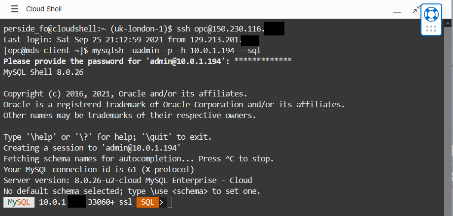

**参考**　

このワークショップではMySQL HeatWaveの管理者アカウントを利用していますが、別のMySQLユーザーを使用する場合、

HeatWave AutoMLを使用するためには以下の権限付与が必要になりますので注意してください。
  - 機械学習データセットを含むスキーマの SELECT および ALTER 権限
  ```
  GRANT SELECT, ALTER ON schema_name.* TO 'user_name'@'%'；
  ```

  - HeatWave AutoML ルーチンが存在する MySQL sys スキーマの SELECT および EXECUTE 権限
  ```
  GRANT SELECT, EXECUTE ON sys.* TO 'user_name'@'%';
  ```

## タスク2: トレーニング用データとテスト用データをロードします
1. MySQL HeatWave DBシステムで機械学習スキーマとテーブルを作成するには、以下のコマンドでサンプルデータベースをダウンロードします：

  - この[リンク](./iris-ml-data.txt)をクリックして、iris-ml-data.txt ファイルをローカルマシンにダウンロードします。
  - ローカルマシンから iris-ml-data.txt をメモ帳等のエディタで開きます。

    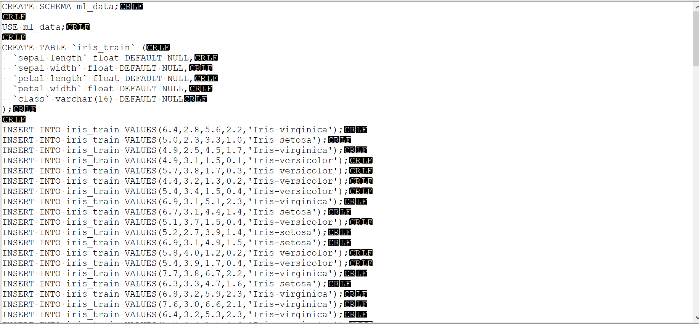

2. MySQL Shellにiris-ml-data.txtの内容をコピー＆ペーストし、最後にEnterを押す。（最後の文の確認を忘れないでください）

    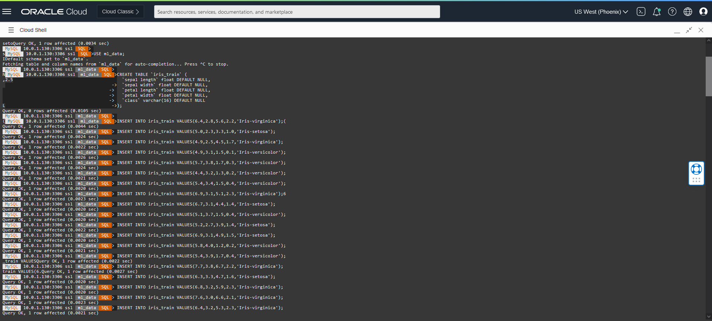

3. 機械学習スキーマ(ml_data)およびスキーマ配下のテーブルを確認する。
   ```
   use ml_data;
   show tables;
   ```

    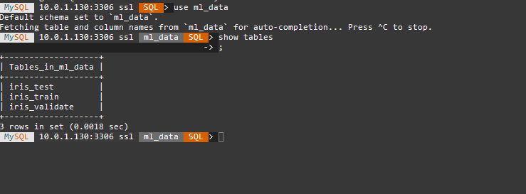

## タスク3: 機械学習モデルのトレーニングを行う(分類)
1. **ML_TRAIN**ルーチンを実行してモデルのトレーニングを行います。
   ```
   CALL sys.ML_TRAIN('ml_data.iris_train', 'class',JSON_OBJECT('task', 'classification'), @iris_model);
   ```

2. トレーニングが終了すると、モデルハンドルが**@iris_model**に出力され、モデルがモデルカタログに格納されます。

   モデルカタログのエントリは以下のクエリで確認することができます。
   ```
   SELECT model_id, model_handle, train_table_name FROM ML_SCHEMA_<管理者ユーザ名>.MODEL_CATALOG;
   ```
    実行例
   
     SELECT model_id, model_handle, train_table_name FROM ML_SCHEMA_admin.MODEL_CATALOG;
   
4. **ML_MODEL_LOAD**ルーチンを使用してモデルをロードします。
   ```
   CALL sys.ML_MODEL_LOAD(@iris_model, NULL);
   ```
   **モデルを使用する前に、モデルをロードする必要があります。**
   
   **モデルはアンロードするか、HeatWaveクラスタを再起動するまでロードされた状態になります。**

   出力例: 
   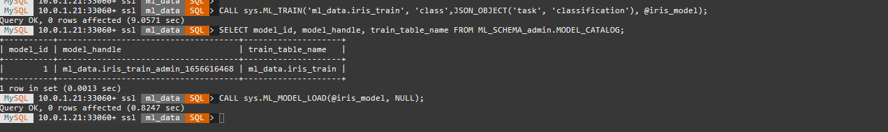

## タスク4: 単一データに対する予測と説明
1. **ML_PREDICT_ROW**ルーチンを使って、1行のデータに対する予測を行います。

  - この例では、データが **@row_input** セッション変数に代入され、その変数がルーチンから呼び出されます。

  - モデルハンドルは **@iris_model** セッション変数を使って呼び出されます。
  ```
  SET @row_input = JSON_OBJECT( "sepal length", 7.3, "sepal width", 2.9, "petal length", 6.3, "petal width", 1.8);
  ```
  ```
  SELECT sys.ML_PREDICT_ROW(@row_input, @iris_model, NULL);
  ```

  出力例：　アイリスがIris-virginicaクラスであると予測し、予測に使われた特徴量も表示されています。
  
  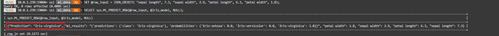  
  
2. 組み込み関数　**JSON_PRETTY** を　使用すると、より読みやすいフォーマットで出力させることができます。

    ```
    SELECT JSON_PRETTY(sys.ML_PREDICT_ROW(@row_input, @iris_model, NULL));
    ```
    
    出力例:
    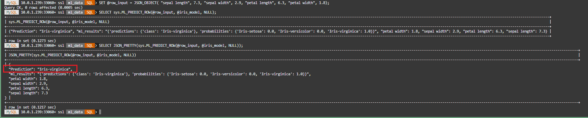

4. どのように予測が行われたかを理解するために、**ML_EXPLAIN_ROW** ルーチンを使って説明を生成します。
   ```
   SELECT JSON_PRETTY(sys.ML_EXPLAIN_ROW(@row_input, @iris_model, JSON_OBJECT( 'prediction_explainer', 'permutation_importance')));
    ```

   返却値は、どの特徴が予測に最も影響を与えたかを示し、予測に影響しない値は0に近い値が返却されます。

   下記の実行例の場合は`petal width_attribution: 0.14`となり予測に影響しない値、`petal length_attribution": 1`となり予測に最も影響を与えたことを示しています。

   出力例: 花弁の長さが最も重要な特徴だと示しています
   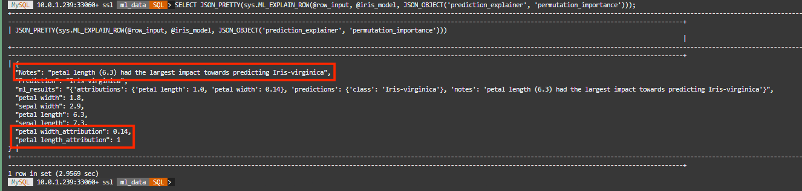
   
## タスク5: テーブルに対する予測と説明
1. **ML_PREDICT_TABLE** ルーチンを使って、テーブルデータに対するの予測を行います。

  ここではiris_testテーブルのデータを入力として受け取り、iris_predictions出力テーブルに予測を出力します。
  ```
  CALL sys.ML_PREDICT_TABLE('ml_data.iris_test', @iris_model,'ml_data.iris_predictions',NULL);
  ```

2. ML_PREDICT_TABLEテーブルに対するクエリを実行して、予測結果を参照します。
  ```
  SELECT * FROM ml_data.iris_predictions LIMIT 3;
  ```

  出力例: 予測値と、それぞれの予測に使われた特徴列の値を示しています
  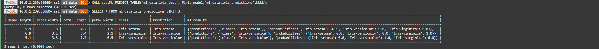

3. **ML_EXPLAIN_TABLE** ルーチンを使って、説明を生成します。
  ```
  CALL sys.ML_EXPLAIN_TABLE('ml_data.iris_test', @iris_model, 'ml_data.iris_explanations', JSON_OBJECT('prediction_explainer', 'permutation_importance'));
  ```

4. ML_EXPLAIN_TABLEテーブルに対するクエリを実行して、結果を確認します。
  ```
  SELECT * FROM iris_explanations LIMIT 3\G;
  ```

  出力例: 
  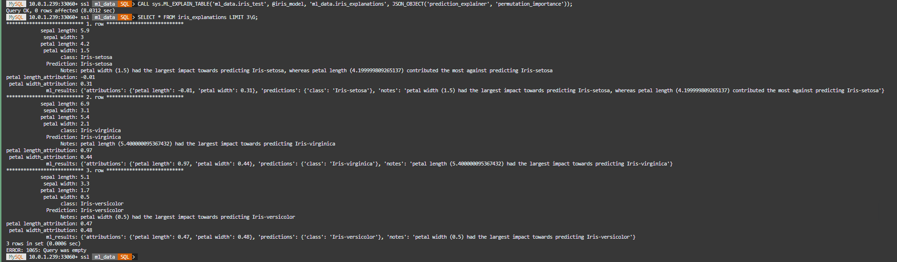
  
## タスク6: 機械学習モデルの評価とモデルアンロード
1. **ML_SCORE** ルーチンを使用してモデルを評価し、モデルの信頼性を確認します。

  この例では、HeatWave AutoMLでサポートされている多くのスコアリング指標の1つであるbalanced_accuracy指標を使用しています。
  ```
  CALL sys.ML_SCORE('ml_data.iris_validate', 'class', @iris_model, 'balanced_accuracy', @score,null);
  ```

2. 計算されたスコアを取得するには、セッション変数 **@score** を参照します。
   ```
   SELECT @score;
   ```
  出力例：
  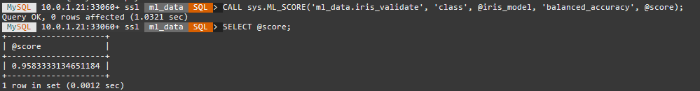

3. **ML_MODEL_UNLOAD** ルーチンを使用してモデルをアンロードします。
   ```
   CALL sys.ML_MODEL_UNLOAD(@iris_model);
   ```

  ***メモリ消費をしすぎないように、使い終わったらモデルをアンロードしてください***

**補足資料**

[HeatWave AutoML](https://dev.mysql.com/doc/heatwave/en/mys-hwaml-machine-learning.html)


***[次のセクションへ](../lab5/readme.md)***
