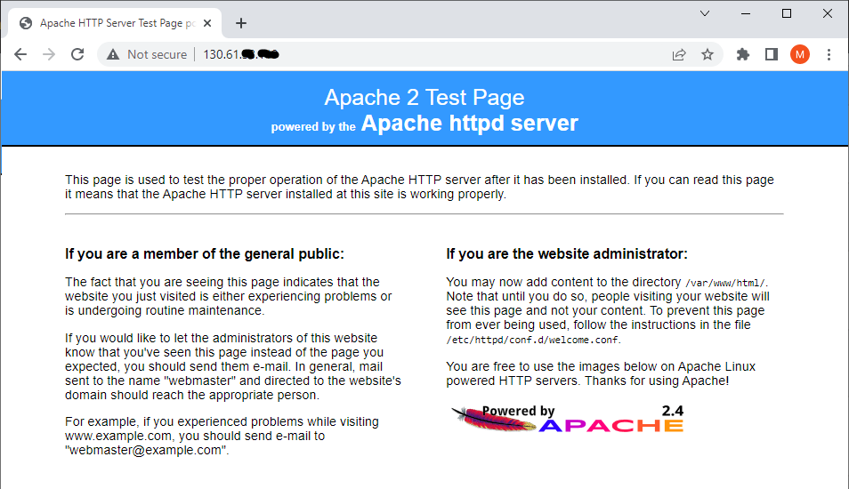
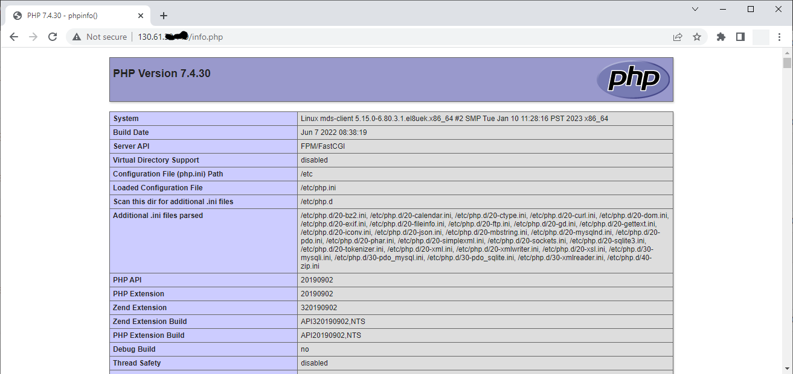
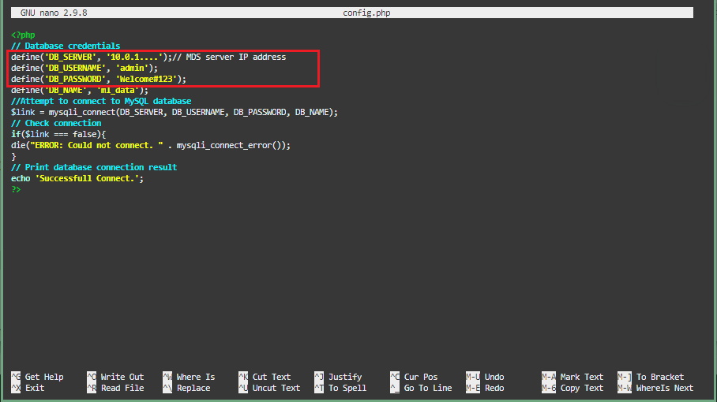
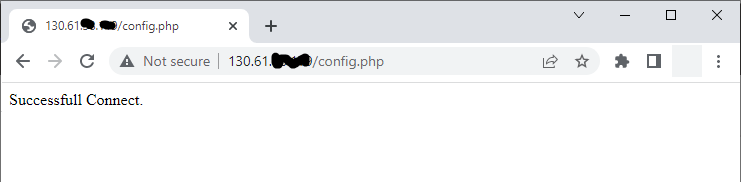
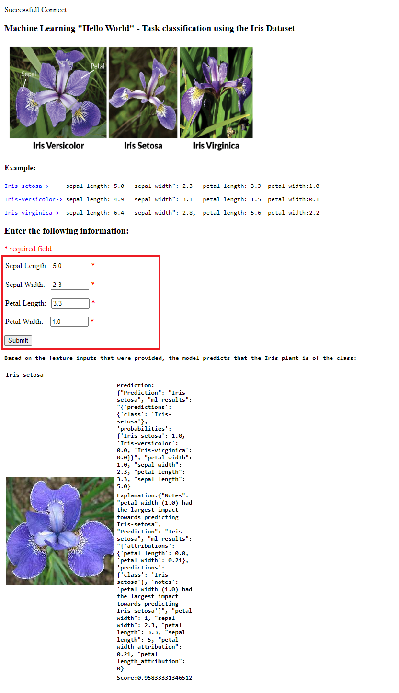

# (参考)PHPとHeatWave AutoMLを利用して簡単なアプリを作成する

HeatWave AutoMLは、既存の開発作業に簡単に使用することができます。

また、LAMPやその他のソフトウェアスタックを使用して新しいアプリケーションを作成することもできます。

ここではApache と PHP をインストールし、PHP / MySQL AutoMLを使用したアプリケーション作成方法をご紹介します。

## タスク1: Webサーバー(Apache)をインストールする
1. Cloud Shellなどのコマンドラインから、コンピュートインスタンスにSSH接続します。

   "秘密鍵ファイル "と "新しいコンピュートインスタンスのIP "はお使いの環境の情報に置き換えてください。
    ```
    ssh -i <秘密鍵ファイルパス> opc@<コンピュートインスタンスのパブリックIPアドレス>
    ```
2. Apacheをセットアップします。
  - Apacheをインストールします。
  ```
  sudo yum install httpd -y
  ```
  - Apacheを有効にします。
  ```
  sudo systemctl enable httpd
  ```
  - Apacheサービスを開始します。
  ```
  sudo systemctl restart httpd
  ```
  - ファイアウォールの設定
  ```
  sudo firewall-cmd --permanent --add-port=80/tcp
  ```
  - ファイアウォールをリロードする。
  ```
  sudo firewall-cmd --reload
  ```

  - ブラウザから、コンピュートインスタンスのパブリックIPアドレスを使って、ローカルマシンからapacheの動作を確認します。
  
  **例：http://129.213...**

   

## タスク2: PHPをインストールする
  1. php7.4 をインストールします。
  ```
  sudo dnf module install php:7.4 -y
  ```
  2. 関連する PHP ライブラリをインストールします。
  ```
  sudo yum install php-cli php-mysqlnd php-zip php-gd php-mbstring php-xml php-json -y
  ```
  3. PHP / MySQL ライブラリの表示
  ```
  php -m |grep mysql
  ```
  4. PHP のバージョンを表示する
  ```
  php -v
  ```
  5. Apache を再起動する
  ```
  sudo systemctl restart httpd
  ```
  6. テスト用PHPファイル(info.php)を作成する。
  ```
  sudo nano /var/www/html/info.php
  ```
  7. エディタに以下のコードを追加し、ファイルを保存する (ctr + o) (ctrl + x)
  ```
  <?php
  phpinfo()；
  ?>
  ```
  8. ローカルマシンからinfo.phpページをブラウズし、PHP設定が読み込めることを確認します。


## タスク3: HeatWave AutoMLを使ったアプリを作成する
1. Apache が MySQL に接続できるように SELinux の設定します。
  ```
  sudo setsebool -P httpd_can_network_connect 1
  ```

2. Irisアプリケーションのzipファイルをダウンロードして展開する。
  ```
  cd /var/www/html

  sudo wget https://objectstorage.us-ashburn-1.oraclecloud.com/p/EQTHbWQcztdMROAhjbJBgPdyK8gqU-khhM871SJCxsmsMHqJlGvGrJ6z5uSQlxot/n/mysqlpm/b/mysql_iris_ml_app/o/iris_app.zip

  sudo unzip iris_app.zip
  ```

3. MySQL HeatWaveに接続するようにアプリケーションを設定する。
config.phpファイルのデータベースIPをHeatwaveのデータベースIPに置き換えて保存します。
  ```
  sudo nano iris_app/config.php
  ```


4. ローカルマシンからconfig.phpのページをブラウズし、接続成功のメッセージを確認します。

   エラーが表示された場合は、それを修正してから続行してください。

   config.phpのテスト例 **http://150.230....iris_app/config.php**



5. 接続テストが成功したら、以下のようにアプリケーションを実行してください：
   ```
    http://<コンピュートインスタンスのIPアドレス>/iris_app/index.php
    ```


6. テキスト・ボックスにテスト値を入力し（ページ内の例を使用できます）、 **Submit** ボタンを押すと予測結果が表示されます。

