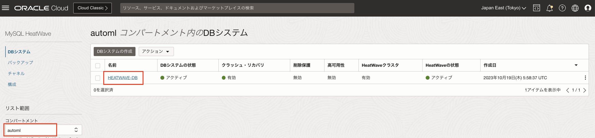
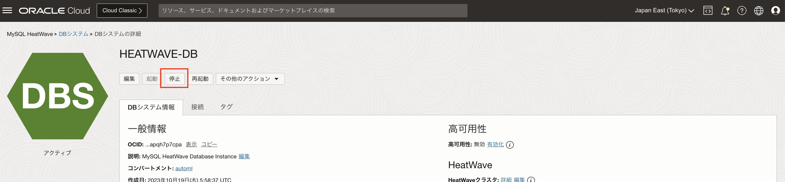
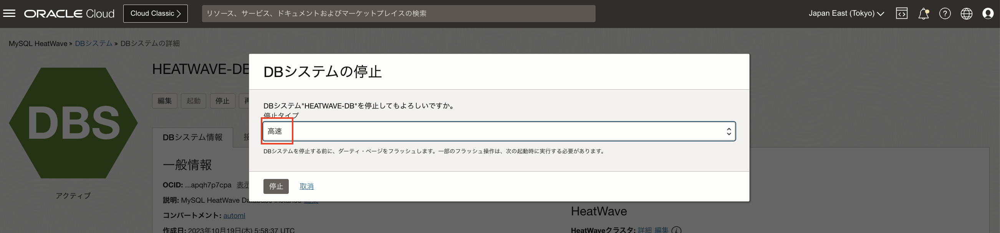
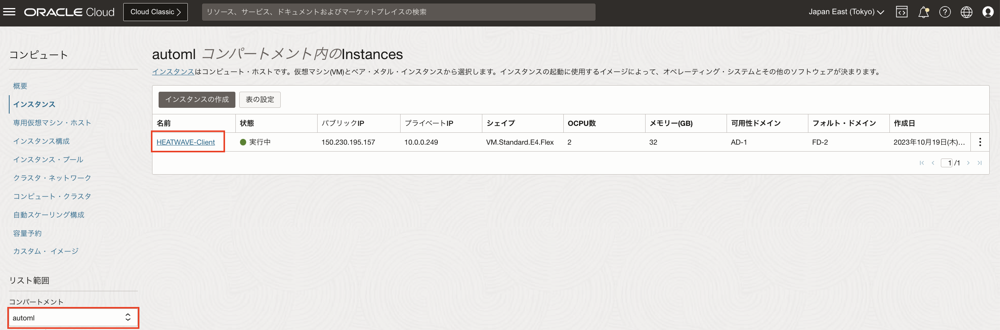
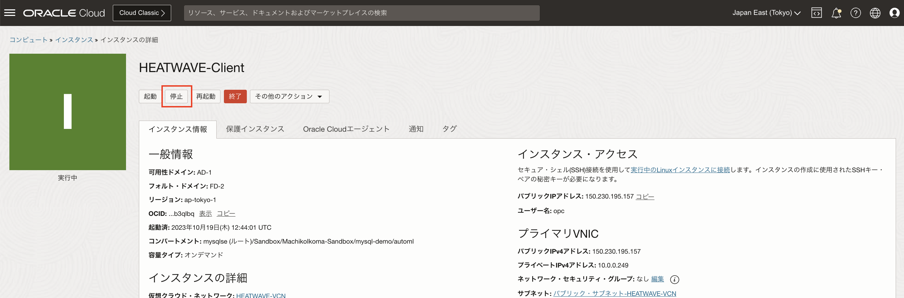
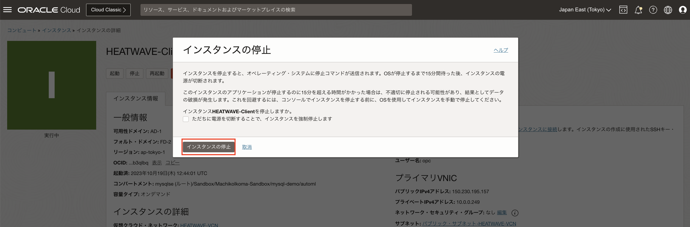

# OCIコンソールからサービスを停止する

このセクションでは、ワークショップで使用したMySQL HeatWave、コンピュートインスタンス等のサービスを停止する

## タスク1: MySQL HeatWaveインスタンスを停止する
1. OCIメニューから[データベース]-[MySQL HeatWave]-[DBインスタンス]を選択する

2. [automl]コンパートメントを選択してインスタンス一覧から[HEATWAVE-DB]を選択する

3. [HEATWAVE-DB]詳細画面で[停止]ボタンをクリックします。

4. [DBシステムの停止]画面で[停止]ボタンをクリックします。

## タスク2: MySQL コンピュートインスタンスを停止する
1. OCIメニューから[コンピュート]-[インスタンス]を選択する

2. [automl]コンパートメントを選択してインスタンス一覧から **HHEATWAVE-Client** を選択する

3. [HEATWAVE-Client]詳細画面で[停止]ボタンをクリックします。

4. [DBシステムの停止]画面で[停止]ボタンをクリックします。

[次のセクションへ](../lab7/readme.md)

### (参考)コンパートメント配下のリソースを削除する
***未稿***
