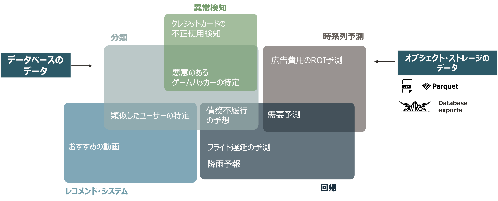
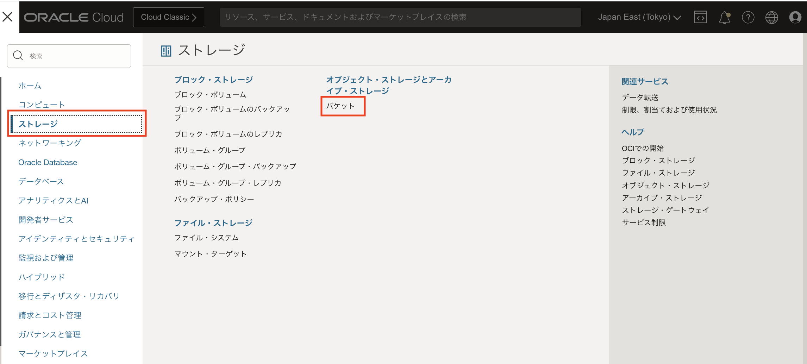
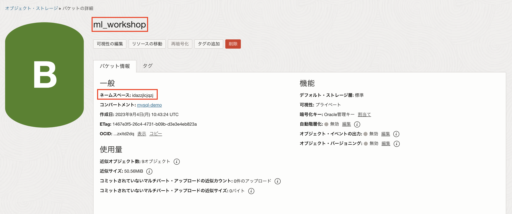
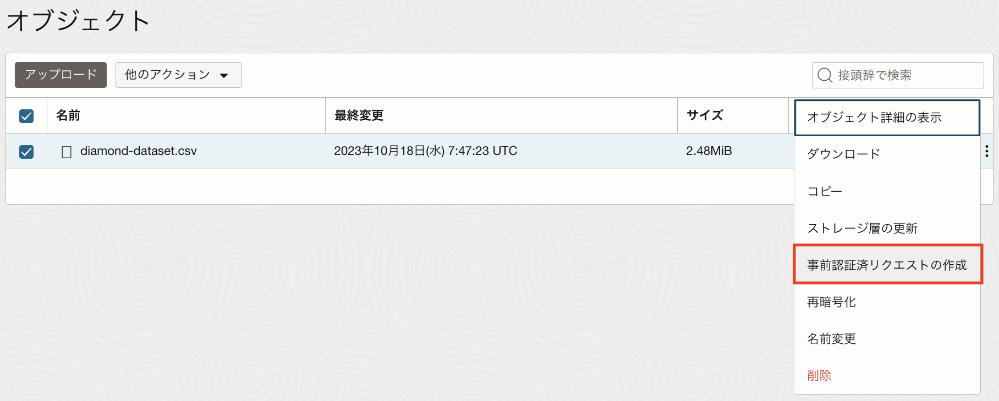
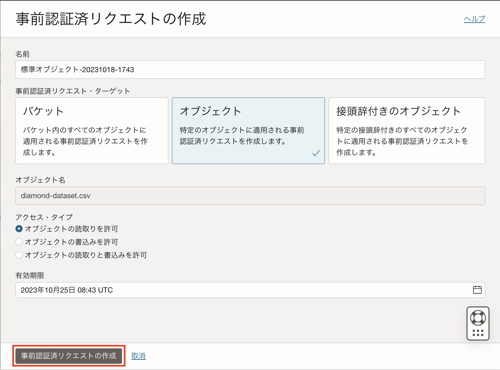
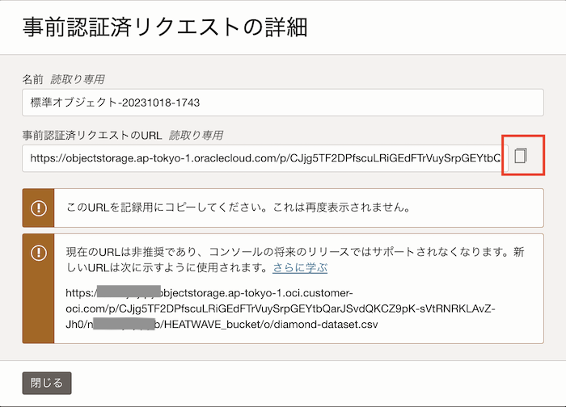

# (参考)HeatWave AutoMLで作成できる機械学習モデル
lab4で作成した機械学習モデルはアヤメの分類モデルですが、他の種類のモデルも作成することができます。

** HeatWave AutoMLで作成できる機械学習モデル(2023年10月現在) **


それぞれのモデルを作成するには、ML_TRAIN()ルーチンのパラメタ指定を変更することで可能です。ルーチンの実行プロセスを変更する必要はありません。

** ML_TRAINで指定できるオプション(8.1.0/8.0.34以降) **
```
mysql> CALL sys.ML_TRAIN ('table_name', 'target_column_name', [options], model_handle);
 
options: {
    JSON_OBJECT('key','value'[,'key','value'] ...)
        'key','value':
        |'task', {'classification'|'regression'|'forecasting'|'anomaly_detection'|'recommendation'}|NULL
        |'datetime_index', 'column'
        |'endogenous_variables', JSON_ARRAY('column'[,'column'] ...)
        |'exogenous_variables', JSON_ARRAY('column'[,'column'] ...)
        |'model_list', JSON_ARRAY('model'[,'model'] ...)
        |'exclude_model_list', JSON_ARRAY('model'[,'model'] ...)
        |'optimization_metric', 'metric'
        |'include_column_list', JSON_ARRAY('column'[,'column'] ...)
        |'exclude_column_list', JSON_ARRAY('column'[,'column'] ...)
        |'contamination',  'contamination factor'
        |'users', 'users_column'
        |'items', 'items_column'
        |'notes', 'notes_text'
}
```

*** MySQL HeatWaveバージョンによって指定できるオプションが異なります。詳細は[ドキュメント](https://dev.mysql.com/doc/heatwave/en/mys-hwaml-ml-train.html)を参照してください。 ***

### データファイル(.csv)の利用方法
1. GitHubから該当のCSVファイルをダウンロードします。
2. OCIコンソールのメニューから[ストレージ]-[バケット]を選択します。
   
   
3. [バケットの作成]を選択し、任意のバケット名を指定し作成します。
    ***バケット名、ネームスペースを控えておきます***
   

4. [アップロード]ボタンをクリックし、CSVファイルをアップロードします。

5. [事前認証済リクエストの作成]を選択して作成されたURLをコピーします。
   
   
   
   
7. コンピュートインスタンスにCloud Shellでログインし、前の手順で作成したURLを指定してバケットに格納したファイルを取得します。
  ```
  $ wget https://objectstorage.ap-tokyo-1.oraclecloud.com/n/<ネームスペース>/b/<アップロードしたcsvファイル名>
  ```

各モデルの作成方法
[レコメンデーションモデルの作成](./recommendation.md)
