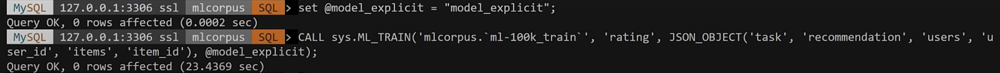
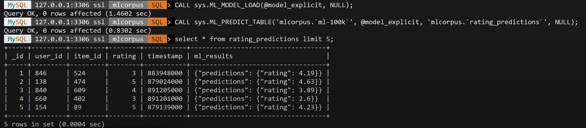
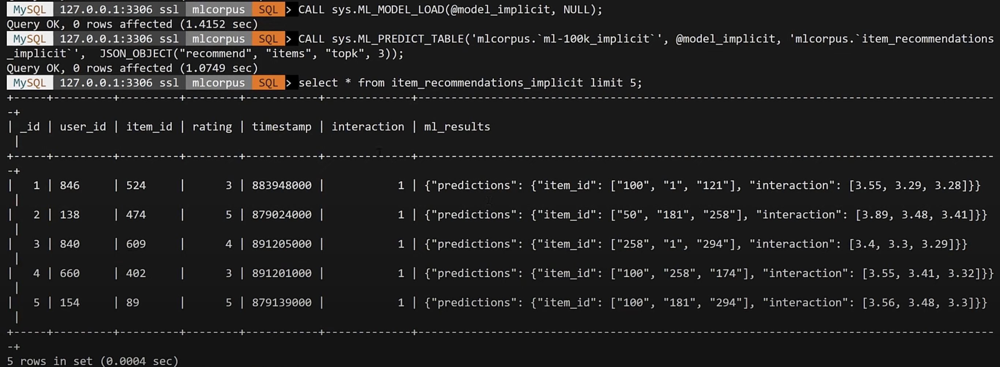

# レコメンド・システムモデルを作成する

ここでは、ユーザーの好みに基づいた映画をおすすめする機械学習モデルを作成します。

レコメンド・システムモデルの作成にはユーザからのフィードバックなど`明示的なデータ(explicit)`を基に作成する場合と、クリック履歴や視聴履歴などの`暗黙的なデータ(implicit)`を基に作成する場合があります。

HeatWave AutoMLではどちらの場合もレコメンデーションモデルを作成することができます。

*暗黙的なデータを基にモデルを作成するには`8.0.34-u4-cloud`にアップグレードされている必要があります。

*[デモ動画](https://youtu.be/cNqo-5OMPpg?si=0q9TlqQrNIw7A2wk)がYouTubeで公開されています。

## タスク1: データを準備する
1. CSVファイルをダウンロードして、オブジェクト・ストレージに格納します。
    [ml-100k_train.csv](lab7/reccomendation/ml-100k_train.csv)
    [ml-100k_test.csv](lab7/reccomendation/ml-100k_test.csv)   

2. MySQL ShellでMySQL HeatWaveに接続し、SQLモードでスキーマ、テーブルを作成します。
```sql
CREATE DATABASE mlcorpus;

USE mlcorpus;

SET GLOBAL local_infile=ON;
SET GLOBAL max_allowed_packet=1073741824;

DROP TABLE IF EXISTS `ml-100k_train`;
CREATE TABLE `ml-100k_train` (user_id VARCHAR(10), item_id VARCHAR(10), rating FLOAT, id MEDIUMINT NOT NULL AUTO_INCREMENT, PRIMARY KEY (id));

DROP TABLE IF EXISTS `ml-100k_test`;
CREATE TABLE `ml-100k_test` LIKE `ml-100k_train`;
```

3. MySQL ShellのJavaScriptモードに変更し、テーブルインポートユーティリティを実行します。
```js
\js
util.importTable("ml-100k_train.csv",{table: "ml-100k_train", dialect: "csv-unix", skipRows:1})
util.importTable("ml-100k_test.csv",{table: "ml-100k_test", dialect: "csv-unix", skipRows:1})
```

3. MySQL ShellのSQLモードに変更し、テーブルの作成とデータが格納されていることを確認します。
```sql
\sql
CREATE TABLE `ml-100k`LIKE `ml-100k_test`;
INSERT INTO `ml-100k`
SELECT * FROM `ml-100k_test` LIMIT 5;
SELECT * FROM `ml-100k_train` LIMIT 10;
```


## タスク2: 明示的データからモデルを作成する(explicit)
基となるアンケートで収集したユーザーのフィードバック(1〜5)に基づいて定量化された情報からおすすめする映画を抽出します。
モデルはHeatWave AutoMLの各ルーチンを実行することで作成できます。

1. モデル名を指定してML_TRAINルーチンを実行します。この時使用するカラム名とモデル種類を指定します。

- テーブル名: mlcorpus.ml-100k_train
- カラム名: rating
- オプション:
    - タスク: recommendation
    - ユーザーIDカラム名: user_id
    - アイテムIDカラム名: item_id
- モデルハンドル: @model_explicit

```sql
set @model_explicit = "model_explicit";

#`ml-100k_train`テーブルを基にモデル`@model_explicit`を作成
CALL sys.ML_TRAIN('mlcorpus.`ml-100k_train`', 'rating', JSON_OBJECT('task', 'recommendation', 'users', 'user_id', 'items', 'item_id'), @model_explicit);
```



2. 作成したモデルをロードします。
```sql
#作成したモデル`@model_explicit`をロード
CALL sys.ML_MODEL_LOAD(@model_explicit, NULL);
```

3. 作成したモデルを使用してレコメンドを生成します。
  - 対象テーブル名: mlcorpus.ml-100k
  - 対象モデル: @model_explicit
  - 出力テーブル名: mlcorpus.rating_predictions

```sql
#作成したモデルを基にレコメンドを生成し、出力結果を5件確認
CALL sys.ML_PREDICT_TABLE('mlcorpus.`ml-100k`', @model_explicit, 'mlcorpus.`rating_predictions`', NULL);
SELECT * FROM rating_predictions LIMIT 5;
```


4. レコメンド・システムのオプションを指定するとより詳細なレコメンドを生成することができます。次にユーザーが好むアイテム上位3件のレコメンドを生成してみます。
  - 対象テーブル名: mlcorpus.ml-100k
  - 対象モデル: @model_explicit
  - 出力テーブル名: mlcorpus.item_recommendations
  - レコメンドオプション: "items", "topk", 3

```sql
#ユーザーに対するtopKレコメンドを生成し、出力結果を5件確認
CALL sys.ML_PREDICT_TABLE('mlcorpus.`ml-100k`', @model_explicit, 'mlcorpus.`item_recommendations`',  JSON_OBJECT("recommend", "items", "topk", 3));
SELECT * FROM item_recommendations LIMIT 5;
```


5. 次にアイテムを好むユーザー上位3件のレコメンドを生成してみます。それぞれの映画について、機械学習モデルがその映画を好きだと思う上位3人のユーザーと評価レートを得ることができます。
- 対象テーブル名: mlcorpus.ml-100k
- 対象モデル: @model_explicit
- 出力テーブル名: mlcorpus.item_recommendations
- レコメンドオプション: "users", "topk", 3

```sql
#アイテムに対するtopKレコメンドを生成し、出力結果を5件確認
CALL sys.ML_PREDICT_TABLE('mlcorpus.`ml-100k`', @model_explicit, 'mlcorpus.`user_recommendations`',  JSON_OBJECT("recommend", "users", "topk", 3));
SELECT * FROM user_recommendations LIMIT 5;
```


## タスク3: 暗黙的データからモデルを作成する(implicit)
ユーザーのフィードバックなど明示的データを取得するよりも、リンクのクリック履歴や映画の視聴履歴、サイトの滞在時間などユーザーの行動を検出・監視することが容易なケースがあります。

これらは暗黙的データと呼ばれ、このデータを基にレコメンド・システムを生成することができます。

タスク2で使用したデータは明示的データですが、ここでは評価データをバイナライズすることで暗黙的データに変換してモデルを作成してみます。

***この手順を実行するには8.0.34-u4-cloudにアップグレードされている必要があります***

1. 既存テーブルを基に暗黙的データを擬似的に作成します。ここでは`interaction`カラムを追加して、評価が1以上のデータをユーザーが何かしらの行動を起こした映画と想定してデータとして用いています。

```sql
#ml-100k_trainを基にml-100k_train_implicitテーブルを作成
CREATE TABLE `ml-100k_train_implicit`LIKE `ml-100k_train`;

#ml-100k_train_implicitテーブルにinteractionカラムを追加
ALTER TABLE `ml-100k_train_implicit` ADD interaction INT;

#ml-100k_train_implicitテーブルにデータを格納
INSERT INTO `ml-100k_train_implicit` SELECT *, rating > 0 AS interaction FROM `ml-100k_train`;

#レコメンドを生成するテーブルをml-100k_train_implicitから複製して作成
CREATE TABLE `ml-100k_implicit`LIKE `ml-100k_train_implicit`;

#ml-100k_test_implicitテーブルにデータを格納
INSERT INTO `ml-100k_implicit` SELECT * FROM `ml-100k_train_implicit` limit 5;

#ml-100k_test_implicitテーブルのデータを確認
SELECT * from `ml-100k_implicit` limit 10;
```


2. 作成したデータからモデルを作成します。
- 対象テーブル名: mlcorpus.ml-100k_train_implicit
- 対象カラム名: interaction
- レコメンドオプション: 'task', 'recommendation', 'users', 'user_id', 'items', 'item_id', 'feedback', 'implicit'
- モデルハンドル: @model_implicit

    ```sql
    set @model_implicit = "model_implicit";

    CALL sys.ML_TRAIN('mlcorpus.`ml-100k_train_implicit`', 'interaction', JSON_OBJECT('task', 'recommendation', 'users', 'user_id', 'items', 'item_id', 'feedback',     'implicit'), @model_implicit);
    ```


3. 作成したモデルをロードしてレコメンドを生成します。
- 対象テーブル名: mlcorpus.ml-100k_implicit
- モデルハンドル: @model_implicit
- 出力テーブル名: mlcorpus.item_recommendations_implicit
- レコメンドオプション: "recommend", "items", "topk", 3

   ```sql
   #モデルのロード
   CALL sys.ML_MODEL_LOAD(@model_implicit, NULL);

   #ユーザーに対するtopKレコメンドを生成し、出力結果を5件確認
   CALL sys.ML_PREDICT_TABLE('mlcorpus.`ml-100k_implicit`', @model_implicit, 'mlcorpus.`item_recommendations_implicit`', JSON_OBJECT("recommend", "items", "topk", 3));
   
    SELECT * FROM item_recommendations_implicit LIMIT 5;
    ```


