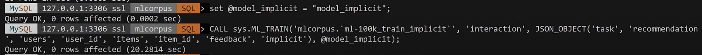

# Creating Recommendation System

In this section, we will create a machine learning model that recommends movies based on user preferences.

A recommendation system can be created based on `explicit data` such as user feedback, or it can be created based on `implicit data` such as click history or viewing history.

HeatWave AutoML can create recommendation models in both cases.

*You must be upgraded to `8.0.34-u4-cloud` to create models based on implicit data.

*[Demo video](https://youtu.be/cNqo-5OMPpg?si=0q9TlqQrNIw7A2wk) is available in YouTube.

## Task1: Preparing data
1. Download the CSV file and store it in object storage.
    [ml-100k_train.csv](./reccomendation/ml-100k_train.csv)
    [ml-100k_test.csv](./reccomendation/ml-100k_test.csv)

2. Connect to MySQL HeatWave with MySQL Shell and create schema and tables in SQL mode.
```sql
CREATE DATABASE mlcorpus;

USE mlcorpus;

SET GLOBAL local_infile=ON;
SET GLOBAL max_allowed_packet=1073741824;

DROP TABLE IF EXISTS `ml-100k_train`;
CREATE TABLE `ml-100k_train` (user_id VARCHAR(10), item_id VARCHAR(10), rating FLOAT, id MEDIUMINT NOT NULL AUTO_INCREMENT, PRIMARY KEY (id));

DROP TABLE IF EXISTS `ml-100k_test`;
CREATE TABLE `ml-100k_test` LIKE `ml-100k_train`;
```

1. Change to JavaScript mode in MySQL Shell and run the table import utility.
```js
\js
util.importTable("ml-100k_train.csv",{table: "ml-100k_train", dialect: "csv-unix", skipRows:1})
util.importTable("ml-100k_test.csv",{table: "ml-100k_test", dialect: "csv-unix", skipRows:1})
```

1. Change to SQL mode in MySQL Shell and verify tables are created and data is stored.
```sql
\sql
CREATE TABLE `ml-100k`LIKE `ml-100k_test`;
INSERT INTO `ml-100k`
SELECT * FROM `ml-100k_test` LIMIT 5;
SELECT * FROM `ml-100k_train` LIMIT 10;
```


## Task2: Creating model from explicit data
It extracts recommended movies from quantified information based on user feedback (1-5) questionnaire.
The model can be created by executing HeatWave AutoML routines.

To create a recommendation model, specify `recommendation` as a parameter.

1. Execute the ML_TRAIN routine with the model name. Specify the column name and model type to be used.

- table name: mlcorpus.ml-100k_train
- column name: rating
- option:
    - task: recommendation
    - users: user_id
    - items: item_id
- model handle: @model_explicit

```sql
set @model_explicit = "model_explicit";

#creating `@model_explicit` with `ml-100k_train`table
CALL sys.ML_TRAIN('mlcorpus.`ml-100k_train`', 'rating', JSON_OBJECT('task', 'recommendation', 'users', 'user_id', 'items', 'item_id'), @model_explicit);
```


1. Load the model.
```sql
#load `@model_explicit` model
CALL sys.ML_MODEL_LOAD(@model_explicit, NULL);
```

1. Creating recommend with model.
  - table name: mlcorpus.ml-100k
  - model handle: @model_explicit
  - output table name: mlcorpus.rating_predictions

```sql
#Generate recommendations based on the created model and check 5 output results.
CALL sys.ML_PREDICT_TABLE('mlcorpus.`ml-100k`', @model_explicit, 'mlcorpus.`rating_predictions`', NULL);
SELECT * FROM rating_predictions LIMIT 5;
```


1. More detailed recommendations can be generated by specifying the options of the recommendation system. Next, let's generate recommendations for the top 3 items preferred by the user.
  - table name: mlcorpus.ml-100k
  - model handle: @model_explicit
  - output tablel name: mlcorpus.item_recommendations
  - recommend options: "items", "topk", 3

```sql
#Generate topK recommendations for users and check 5 output results.
CALL sys.ML_PREDICT_TABLE('mlcorpus.`ml-100k`', @model_explicit, 'mlcorpus.`item_recommendations`',  JSON_OBJECT("recommend", "items", "topk", 3));
SELECT * FROM item_recommendations LIMIT 5;
```


1. Generate recommendations for the top 3 users who like the item. For each movie, we get the top 3 users that the machine learning model thinks would like that movie and their rating rate.
- table name: mlcorpus.ml-100k
- model handle: @model_explicit
- output table name: mlcorpus.item_recommendations
- recommend options: "users", "topk", 3

```sql
#generate topK recommendations for items and check 5 output results.
CALL sys.ML_PREDICT_TABLE('mlcorpus.`ml-100k`', @model_explicit, 'mlcorpus.`user_recommendations`',  JSON_OBJECT("recommend", "users", "topk", 3));
SELECT * FROM user_recommendations LIMIT 5;
```


## Task3: Create model from implicit data
In some cases, it is not easy to get direct feedback from the users. On the other hand, the user behavior can be monitored more easily. we can save which links they clicked on or which video they watched and how much time they spend on a specific page. 

These are called implicit data, and recommender systems can be generated based on this data.

The data used in Task 2 is explicit data, but here we will try to create a model by converting the evaluation data into implicit data by binarizing it.

***You must be upgraded to 8.0.34-u4-cloud to use implicit data***

1. create implicit data based on the existing tables. Add an `interaction` column and use data with a rating of 1 or higher as data assuming that the user has taken some action on the movie.

```sql
#create ml-100k_train_implicit table based on ml-100k_train
CREATE TABLE `ml-100k_train_implicit`LIKE `ml-100k_train`;

#add interaction column to ml-100k_train_implicit
ALTER TABLE `ml-100k_train_implicit` ADD interaction INT;

#store data in ml-100k_train_implicit
INSERT INTO `ml-100k_train_implicit` SELECT *, rating > 0 AS interaction FROM `ml-100k_train`;

#copy ml-100k_train_implicit to ml-100k_implicit
CREATE TABLE `ml-100k_implicit`LIKE `ml-100k_train_implicit`;

#store data in ml-100k_test_implicit
INSERT INTO `ml-100k_implicit` SELECT * FROM `ml-100k_train_implicit` limit 5;

#clarify ml-100k_test_implicit data
SELECT * from `ml-100k_implicit` limit 10;
```


1. creating model from ml-100k_train_implicit
- table name: mlcorpus.ml-100k_train_implicit
- column name: interaction
- redommend options: 'task', 'recommendation', 'users', 'user_id', 'items', 'item_id', 'feedback', 'implicit'
- model handle: @model_implicit

    ```sql
    set @model_implicit = "model_implicit";

    CALL sys.ML_TRAIN('mlcorpus.`ml-100k_train_implicit`', 'interaction', JSON_OBJECT('task', 'recommendation', 'users', 'user_id', 'items', 'item_id', 'feedback',     'implicit'), @model_implicit);
    ```



1. Load the model and generate recommendation
- table name: mlcorpus.ml-100k_implicit
- model handle: @model_implicit
- output table name: mlcorpus.item_recommendations_implicit
- recommend options: "recommend", "items", "topk", 3

   ```sql
   #load the model
   CALL sys.ML_MODEL_LOAD(@model_implicit, NULL);

   #generate topK recommendation for users and check 5 output results
   CALL sys.ML_PREDICT_TABLE('mlcorpus.`ml-100k_implicit`', @model_implicit, 'mlcorpus.`item_recommendations_implicit`', JSON_OBJECT("recommend", "items", "topk", 3));
   
    SELECT * FROM item_recommendations_implicit LIMIT 5;
    ```


